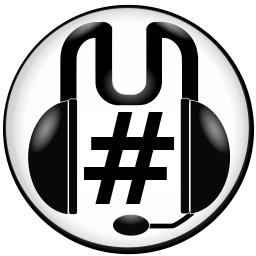

## MumbleSharp

MumbleSharp is Mumble client library and sample client implementations in C#.

[Mumble](https://www.mumble.info/) is a free, open source, low latency, high quality voice chat application.

The solution comes in two parts:

 1. The MumbleSharp Library
    - MumbleSharp is the actual MumbleSharp library which is a class library for building mumble clients.
 2. Demo implementations
    - MumbleClient is a console mumble client, a console application to use for testing and learning.
    - MumbleGuiClient is a winform mumble client, a minimalistic client but fully functional: channels display and switching, message chat, voice support, playback/recording device selection and a very basic voice detection.

As you can see from the MumbleClient Program.cs creating a new client is very simple:

 1. Implement IMumbleProtocol and implement methods to respond to messages of different types however you wish.
 2. Use a MumbleConnection to connect to a server.

## NuGet Package

You may find the MumbleSharp library as a NuGet package:

| Package Name | Version |
|--------------|---------|
| [MumbleSharp][MumbleSharpNuget] | [![MumbleSharpShield]][MumbleSharpNuget] |

[MumbleSharpNuget]: https://www.nuget.org/packages/MumbleSharp/
[MumbleSharpShield]: https://img.shields.io/nuget/vpre/MumbleSharp.svg

## Work In Progress
 
The library nearly supports all non voice things that Mumble can do but for voice support only the [Opus](http://www.opus-codec.org/) encoded packets are supported (Opus is Mumble's primary codec).

## Contributing

I'm only occasionally working on MumbleSharp in my spare time but I'm very happy to receive contributions. If you're thinking of contributing ping me an email (martindevans@gmail.com) and I'll try to give you any advice I can to achieve whatever you want. It would be helpful if you open an issue when you start working on something, that's a good way to make sure no one else is duplicating your work as well as being a good place to have discussions.

When contributing it's often useful to reference the [Mumble source code](https://github.com/mumble-voip/mumble).

### Things To Do

If you want to contribute here's some ideas:
 
#### Jitter Buffer
There is no jitter buffering at the moment. Port the jitter buffering from mumble or implement your own. AudioBuffer.cs is probably the correct place to start doing this.

#### Other Codecs
Supporting other codecs should be relatively simple. For CELT you'll need to find the correct version of the DLL (check out the Mumble-Protocol.pdf for the version) and then write a wrapper with P/Invoke. For Speex you should be able to use NSpeex.

## Looking For VoIP In Unity?

I've developed a VoIP asset for Unity, get it [here](https://www.assetstore.unity3d.com/#!/content/70078?aid=1100lJ2J)
